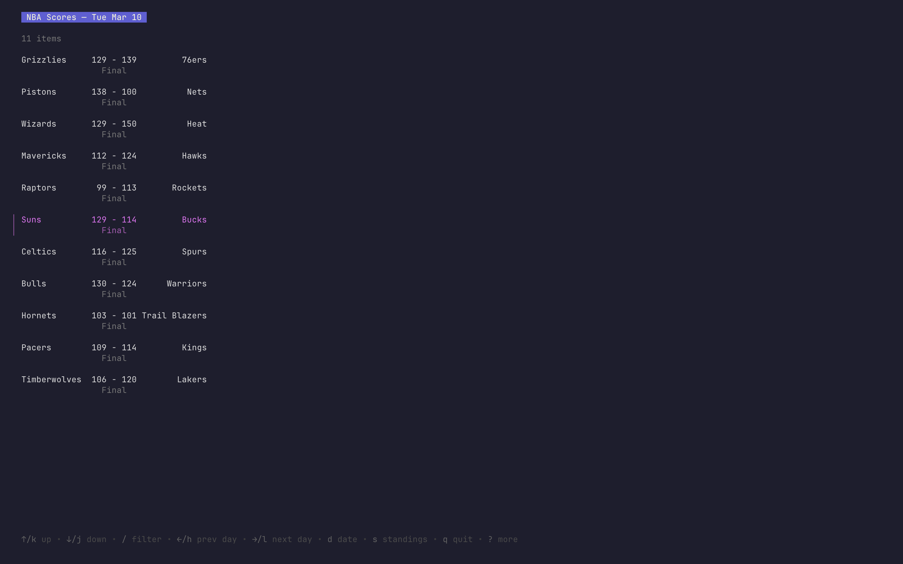
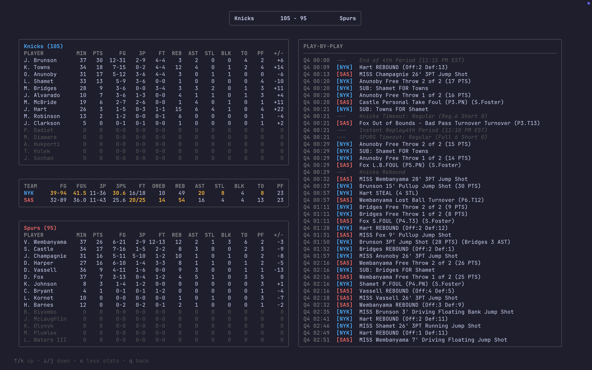
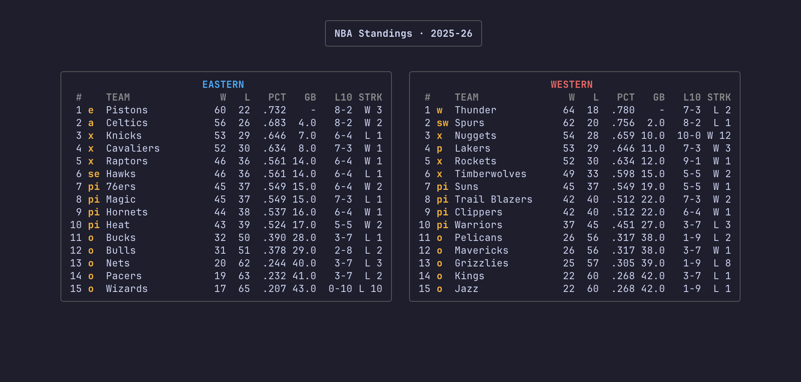

# Courtside

A terminal UI for following NBA games, box scores, and standings. 

Browse the day's games, drill into a live or finished game for its full box
score and play-by-play, jump to any date to see past results, and check the
league standings. Games in progress refresh on their own while you watch.

## Data 

Courtside pulls directly from the NBA's public JSON endpoints via
[`nba-sdk`](https://github.com/NolanFogarty/nba-sdk):

- **cdn.nba.com** — the live "today" scoreboard
- **stats.nba.com** — scoreboard by date, traditional box scores,
  play-by-play, and league standings

These are unofficial, undocumented endpoints, so there's **no API key or
account required** but they can change or rate-limit without notice. Live
games auto-refresh roughly every 15 seconds.

## Installation

### Install from source

```bash
git clone https://github.com/NolanFogarty/courtside.git
cd courtside
go build -o courtside
sudo mv courtside /usr/local/bin/
```

### Install with go install

```bash
go install github.com/NolanFogarty/courtside@latest
```

## Usage

```bash
courtside
```

The app opens on today's games. Everything is keyboard-driven:

### Game list

| Key | Action |
| --- | --- |
| `↑`/`k`, `↓`/`j` | Move between games |
| `enter` | Open the selected game's details |
| `←`/`h`, `→`/`l` | Previous / next day |
| `d` | Jump to a specific date |
| `s` | League standings |
| `/` | Filter games |
| `q` | Quit |

### Game details

| Key | Action |
| --- | --- |
| `↑`/`k`, `↓`/`j` | Scroll the play-by-play feed |
| `o` | Toggle expanded stats |
| `q`/`esc` | Back to the game list |

### Standings

| Key | Action |
| --- | --- |
| `q`/`esc` | Back to the game list |

## Screenshots

### Game List


### Game Details


### Standings

